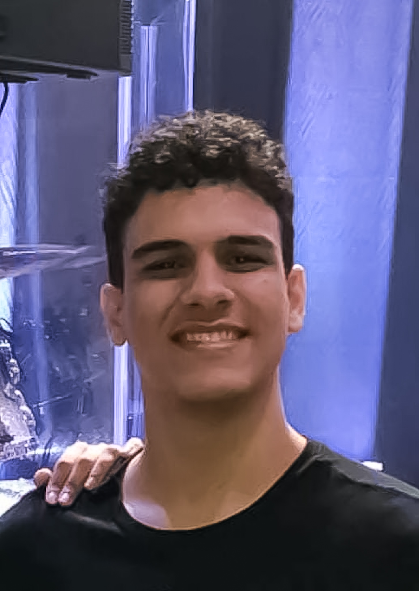

# Rappi4B

## Descrição do Projeto

descrever o projeto aqui

## Imagens

imagens do projeto aqui

## Tecnologias

tecnologias usadas

## O que funciona

funcionalidades ja em uso

## O que não funciona

funcionalidades que faltaram ou estao com defeito

## Contribuidores
<table>
  <tr>
    <td align="center">
      <a href="#">
         
        
          <b>Mariana Mendes</b>
        
      </a>
    </td>
    <td align="center">
      <a href="#">
         
        
          <b>Luis Felipe Melo </b>
        
      </a>
    </td>
    <td align="center">
      <a href="#">
         
        
          <b>João Marcos Alves</b>
        
      </a>
    </td>
    <td align="center">
      <a href="#">
         
        
          <b>Luian Costa </b>
        
      </a>
    </td>
    <td align="center">
      <a href="#">
         
        
          <b>Luis Gustavo</b>
        
      </a>
    </td>
  </tr>
</table>
